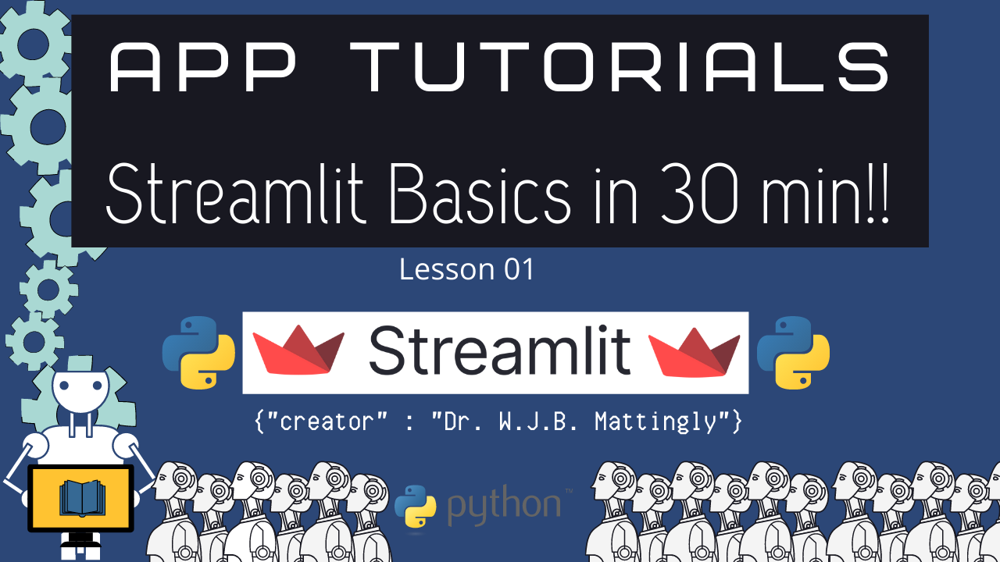

# 
Introduction to Streamlit in Python

### 
by Dr. W.J.B. Mattingly

## Introduction
This repo is designed to hos the code and apps for my Introduction to Streamlit series on YouTube.

## Tentative Schedule

|Lesson|Name|
|------|----------|
|01.01   |Introduction to Streamlit   |
|01.02   |Advanced Features of Streamlit   |
|01.03   |Working with Forms in Streamlit   |
|01.04   |Cache Data in Streamlit   |
|02   |Database App in Streamlit|
|03  |Network Analysis in Streamlit   |
|04   |Natural Language Processing in Streamlit   |
|05   |Machine Learning with ScikitLearn in Streamlit   |
|06   |Deploying Machine Learning Models in Streamlit  |
|07   |Recreating Voyant in Streamlit   |
